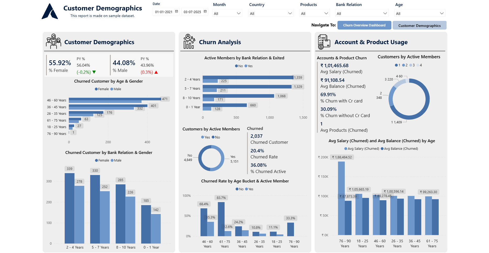
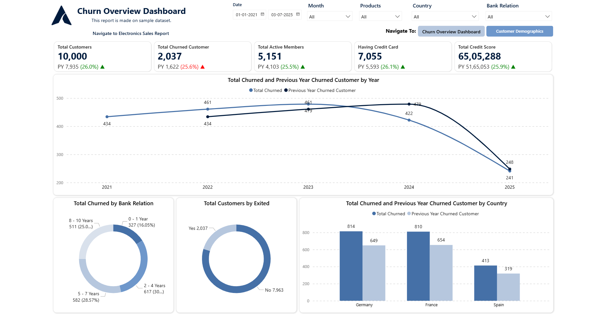

# Customer Demographics & Churn Analysis Dashboard 

## 📊 Project Overview  
This repository showcases my **Power BI Dashboard Project** that provides insights into sales performance, customer segmentation, and trends.  
The PBIX file is **not shared publicly** to protect the dataset, but the screenshots below demonstrate the dashboard design and visuals.  

---

## 🖼️ Dashboard Snapshots  

### Dashboard 1 – Customer Demographics 
  

### Dashboard 2 – Churn Overview Dashboard  
  

---

## ⚙️ Key Features  
- Sales performance tracking (Monthly/Yearly)  
- Regional and product-level breakdown  
- KPI cards with dynamic insights  
- Interactive charts (Pie, Column, Matrix)  
- Drill-through for deeper analysis  

---

## 🚀 Tech Stack  
- **Tool:** Power BI  
- **Data Source:** Excel / SQL (dummy dataset for practice)  
- **Language:** DAX for calculations  

---

## 🔒 Note on PBIX File  
The `.pbix` file and raw dataset are **not uploaded** here to keep the data private. Only dashboard screenshots are shared.  

If you'd like to discuss this project in detail or view a live demo, feel free to connect with me.  

---

## 📬 Contact  
👤 **Aryan Patel**  
- 💼 Power BI Developer | Full Stack Developer  
- 🔗 [LinkedIn](www.linkedin.com/in/aryan-patel-ap02)
- 🔗 [Portfolio](https://www.datascienceportfol.io/aryan_dharmesh_patel)
- 📧 aryanpatelaryan81@gmail.com  
